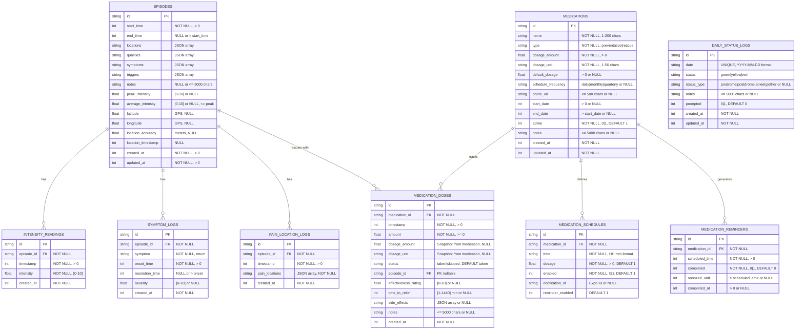

# Entity Relationship Diagram (Mermaid)

This file contains an ER diagram in Mermaid format. You can visualize it by:

1. **GitHub:** Paste the content into a `.md` file and view on GitHub (auto-renders)
2. **Mermaid Live Editor:** https://mermaid.live - copy the diagram section below
3. **VS Code:** Install "Markdown Preview Mermaid Support" extension
4. **Online Tools:** Use any Mermaid-compatible markdown viewer

---

## Complete ER Diagram



---

## Relationship Details

### CASCADE DELETE Relationships

When a parent record is deleted:

```
EPISODES (deleted)
├─ INTENSITY_READINGS → DELETED
├─ SYMPTOM_LOGS → DELETED
├─ PAIN_LOCATION_LOGS → DELETED
└─ MEDICATION_DOSES → episodeId SET TO NULL (preserved)

MEDICATIONS (deleted)
├─ MEDICATION_SCHEDULES → DELETED
├─ MEDICATION_DOSES → DELETED
└─ MEDICATION_REMINDERS → DELETED
```

### SET NULL Relationship

```
EPISODES (deleted)
└─ MEDICATION_DOSES.episode_id → SET NULL
   (dose history preserved, episode link removed)
```

---

## Critical Constraints and Validations

### Episode Entity

```
Temporal:
  start_time > 0 (positive timestamp required)
  end_time NULL OR end_time > start_time
  
Intensity:
  peak_intensity NULL OR (0 <= peak_intensity <= 10)
  average_intensity NULL OR (0 <= average_intensity <= 10)
  average_intensity <= peak_intensity (if both present)
  
Content:
  notes <= 5000 characters
  
Location (GPS):
  All location fields nullable
  location_timestamp should accompany coordinates
```

### Medication Entity

```
Type Constraints:
  type IN ('preventative', 'rescue')
  IF type = 'preventative' THEN schedule_frequency NOT NULL
  
Dosage:
  dosage_amount > 0 (required, positive)
  dosage_unit required (1-50 chars)
  default_dosage NULL OR default_dosage > 0
  
Schedule:
  schedule_frequency IN ('daily', 'monthly', 'quarterly') OR NULL
  
Dates:
  start_date NULL OR start_date > 0
  end_date NULL OR end_date > start_date
  
Status:
  active IN (0, 1), DEFAULT 1
```

### Medication Dose Entity

```
Required:
  medication_id (FK to medications)
  timestamp > 0
  amount >= 0
  status DEFAULT 'taken'

Amount Validation:
  IF status = 'taken' THEN amount > 0 (cannot take 0)
  IF status = 'skipped' THEN amount >= 0 (any value allowed)

Optional References:
  episode_id NULL OR FK to episodes (SET NULL on delete)

Quality Metrics:
  effectiveness_rating NULL OR (0 <= rating <= 10)
  time_to_relief NULL OR (1 <= minutes <= 1440)

Dosage Snapshot:
  dosage_amount = NULL (snapshot of medications.dosage_amount at time of dose)
  dosage_unit = NULL (snapshot of medications.dosage_unit at time of dose)
  ⚠️ NO total_amount field - must multiply: amount * dosage_amount
```

### Medication Reminder Entity

```
Scheduling:
  scheduled_time > 0 (required)
  
Status Rules:
  completed IN (0, 1), DEFAULT 0
  IF completed = 1 THEN completed_at IS NOT NULL
  
Snooze:
  snoozed_until NULL OR snoozed_until > scheduled_time
```

### Daily Status Log Entity

```
Date Rules:
  date UNIQUE
  date format: YYYY-MM-DD (valid date, not in future)
  
Status Rules:
  status IN ('green', 'yellow', 'red')
  
Type Rules:
  status_type NULL OR status_type IN ('prodrome', 'postdrome', 'anxiety', 'other')
  IF status = 'yellow' THEN status_type can be set
  IF status != 'yellow' THEN status_type MUST BE NULL
```

---

## Enum Values Reference

### Pain Locations (10 types)
```
left_eye, right_eye
left_temple, right_temple
left_neck, right_neck
left_head, right_head
left_teeth, right_teeth
```

### Pain Qualities (6 types)
```
throbbing, sharp, dull, pressure, stabbing, burning
```

### Symptoms (9 types)
```
nausea, vomiting, visual_disturbances, aura
light_sensitivity, sound_sensitivity, smell_sensitivity
dizziness, confusion
```

### Triggers (10 types)
```
stress, lack_of_sleep, weather_change, bright_lights
loud_sounds, alcohol, caffeine, food
hormonal, exercise
```

### Medication Types
```
preventative, rescue
```

### Schedule Frequencies
```
daily, monthly, quarterly
```

### Day Status
```
green, yellow, red
```

### Yellow Day Types
```
prodrome, postdrome, anxiety, other
```

### Dose Status
```
taken, skipped
```

---

## Index Map

```
EPISODES
  ├─ PRIMARY KEY: id
  ├─ idx_episodes_start_time: start_time
  └─ idx_episodes_date_range: (start_time, end_time)

INTENSITY_READINGS
  ├─ PRIMARY KEY: id
  ├─ idx_intensity_readings_episode: episode_id
  └─ idx_intensity_readings_time: (episode_id, timestamp)

SYMPTOM_LOGS
  ├─ PRIMARY KEY: id
  └─ idx_symptom_logs_episode: episode_id

PAIN_LOCATION_LOGS
  ├─ PRIMARY KEY: id
  └─ idx_pain_location_logs_episode: episode_id

MEDICATIONS
  ├─ PRIMARY KEY: id
  └─ idx_medications_active_type: (active, type) WHERE active = 1

MEDICATION_SCHEDULES
  ├─ PRIMARY KEY: id
  └─ FK index: medication_id

MEDICATION_DOSES
  ├─ PRIMARY KEY: id
  ├─ idx_medication_doses_medication: medication_id
  ├─ idx_medication_doses_episode: episode_id
  ├─ idx_medication_doses_timestamp: timestamp
  └─ idx_medication_doses_med_time: (medication_id, timestamp DESC)

MEDICATION_REMINDERS
  ├─ PRIMARY KEY: id
  ├─ idx_medication_reminders_scheduled: scheduled_time
  └─ idx_reminders_incomplete: (medication_id, scheduled_time) WHERE completed = 0

DAILY_STATUS_LOGS
  ├─ PRIMARY KEY: id
  ├─ UNIQUE: date
  ├─ idx_daily_status_date: date
  ├─ idx_daily_status_status: status
  └─ idx_daily_status_date_status: (date, status)
```

